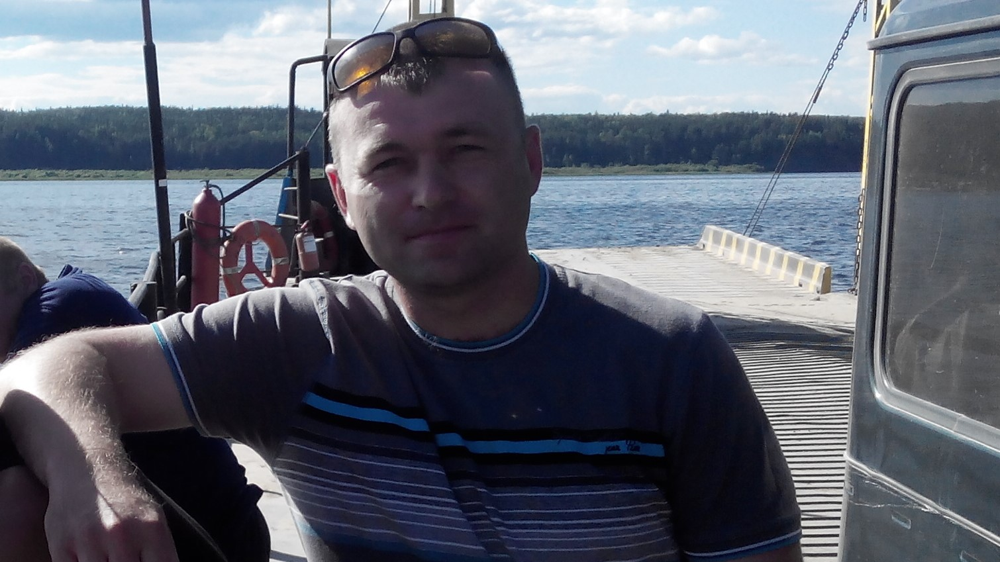

#  << Немного о себе... >> 
----

Я Маслов Евгений Алексеевич. Мне 44 год. Родился и живу в Хакасии. Её еще называют "солнечная Хакасия". Но не путайте с Абхазией. Ничего общего кроме созвучия у нас нет. Я из сибири.

По знаку зодиака - дева. О, и это моя беда. Я стремлюсь к совершенству во всем, учусь всю жизнь и пытаюсь учить других. Стремление к лучшему заставляет подмечать изъяны во всем, что меня окружает.

Работаю в угольной промышленности, обслуживаю и ремонтирую гидравлическую технику (экскаваторы, погрузчики и т.д.). 

В нетологию пришёл за новой, интересной, творческой профессией. И я уверен, что внесу значительный вклад в будущей профессии своей мечты! 

----